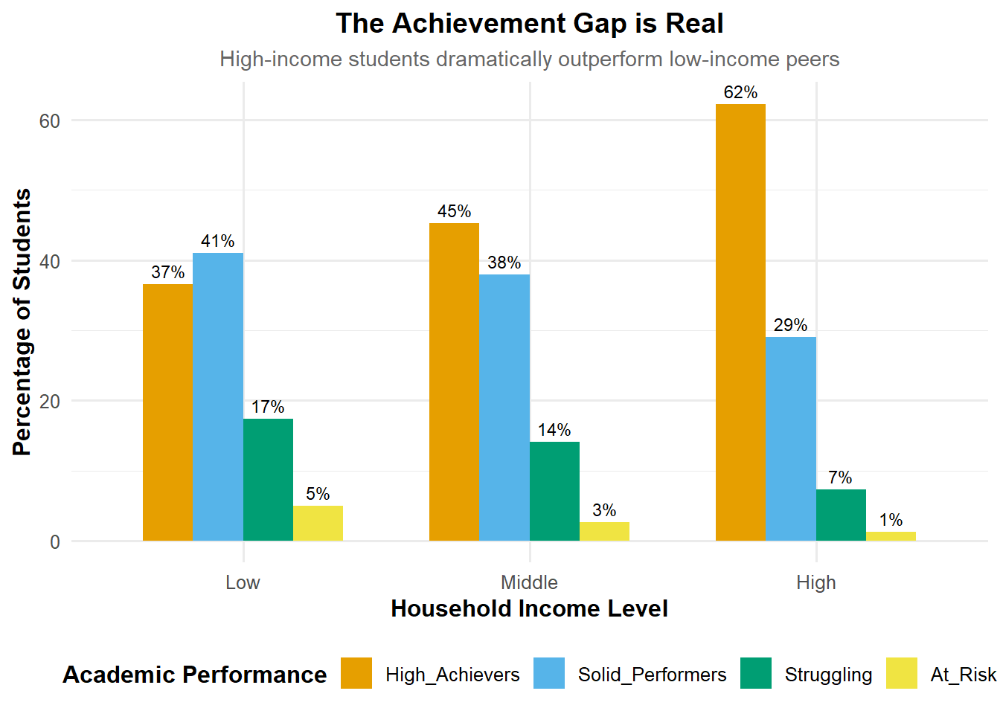
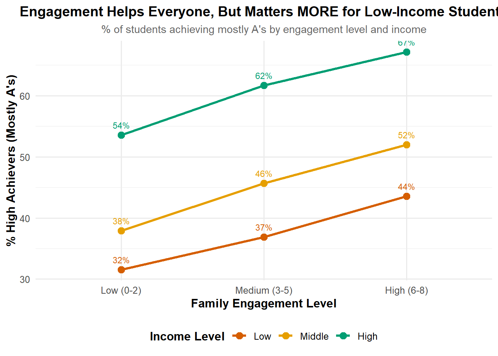
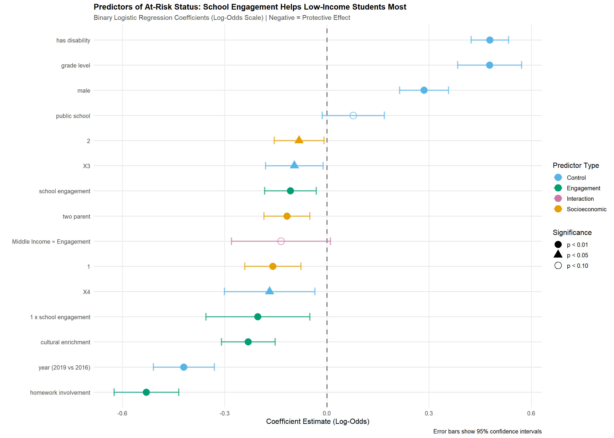

# Educational Equity Project: Statistical Analysis of Family Engagement Effects; Analyzing Compensatory Effects on K-12 Academic Success using Generalized Linear Models

[](https://www.r-project.org/)
[](https://www.tidymodels.org/)

> **Research Question:** Does family engagement in education serve a compensatory function, helping disadvantaged students more than their advantaged peers?

## Project Overview

This project analyzes national survey data (N=25,391) to investigate whether parent involvement can reduce socioeconomic achievement gaps. Using multiple statistical models from the Generalized Linear Model (GLM) family, I found that strategic engagement activities significantly reduce disparities, with **18% stronger protective effects for low-income students** (p < 0.01).

### Key Findings

- **Achievement Gap:** High-income students are 1.7x more likely to earn A's (62.3% vs. 36.5%)
- **Compensatory Effect:** School engagement reduces at-risk probability MORE for low-income students (β = -0.20, OR = 0.82, p = 0.009)
- **Strongest Predictor:** Homework involvement (41% reduction in at-risk odds per SD increase)
- **Robust Results:** Findings replicated across 4 different statistical models

## Learning Objectives Demonstrated

### 1. Probability as Foundation of Statistical Modeling
- Built regression models for multiple outcome types (categorical, binary, count)
- Applied maximum likelihood estimation (MLE) framework
- Used inference tools: p-values, confidence intervals, standard errors
- Validated assumptions through cross-validation and model comparison

### 2. Appropriate Application of GLMs
- **Multinomial Logistic Regression:** 4-category student grades
- **Binary Logistic Regression:** At-risk screening tool  
- **Poisson Regression:** Days absent (count data)
- **Linear Discriminant Analysis:** Validation under different assumptions

## Repository Structure

```
educational-equity-project/
│
├── data/
│   ├── pfi_analysis_data.rds          # Cleaned analysis dataset
│   └── README.md                       # Data dictionary
│
├── code/
│   ├── 01_data_preparation.R          # Import, cleaning, feature engineering
│   ├── 02_exploratory_analysis.R      # EDA and visualizations
│   ├── 03_statistical_modeling.R      # GLM implementations
│   ├── 04_model_evaluation.R          # Cross-validation, diagnostics
│   └── 05_visualization.R             # Publication-quality plots
│
├── output/
│   ├── figures/                        # All visualizations
│   ├── tables/                         # Summary tables
│   └── model_results.rds               # Saved model objects
│
├── docs/
│   ├── analysis_report.pdf             # Full technical report
│   └── blog_post.md                    # Non-technical summary
│
├── README.md                           # This file
└── educational_equity_analysis.Rproj   # RStudio project file
```

## Reproducibility

### Requirements

```r
# Core packages
install.packages(c(
  "tidyverse",      # Data manipulation and visualization
  "tidymodels",     # Unified modeling framework
  "readxl",         # Excel import
  "janitor",        # Data cleaning
  "GGally",         # Pair plots
  "patchwork"       # Plot composition
))

# Modeling packages
install.packages(c(
  "nnet",           # Multinomial logistic regression
  "discrim",        # Discriminant analysis
  "poissonreg",     # Poisson regression
  "caret",          # Confusion matrices
  "pROC"            # ROC curves
))
```

### Running the Analysis

```r
# Clone repository
git clone https://github.com/yourusername/educational-equity-project.git
cd educational-equity-project

# Open RStudio project
# Then run scripts in order:
source("code/01_data_preparation.R")
source("code/02_exploratory_analysis.R")
source("code/03_statistical_modeling.R")
source("code/04_model_evaluation.R")
source("code/05_visualization.R")
```

## Methods

### Data Source
**NCES Parent and Family Involvement in Education (PFI) Survey**
- Years: 2016 & 2019 (combined)
- Final sample: 25,391 students
- 75/25 train-test split with stratified sampling

### Feature Engineering

#### Outcome Variables
1. **grades_cat:** 4-level categorical (High Achievers, Solid Performers, Struggling, At-Risk)
2. **at_risk:** Binary indicator (C's or worse + high absence/low engagement)
3. **days_absent:** Count variable (0, 1, 2, ...)

#### Predictor Composites
- **school_engagement:** Count of 8 activities (events, volunteering, PTA, etc.)
- **homework_involvement:** Standardized composite of frequency, duration, checking
- **cultural_enrichment:** Weighted sum of weekly (stories, crafts) and monthly (library) activities

### Statistical Models

#### 1. Multinomial Logistic Regression (Primary)
```r
multinom_recipe <- recipe(grades_cat ~ 
  school_engagement + homework_involvement + cultural_enrichment +
  income_3cat + parent_ed_3cat + two_parent +
  grade_level + male + has_disability + num_siblings +
  public_school + year + race_ethnicity,
  data = train_data) %>%
  step_dummy(all_nominal_predictors()) %>%
  step_interact(~ starts_with("income_3cat"):school_engagement) %>%
  step_interact(~ starts_with("parent_ed_3cat"):homework_involvement) %>%
  step_normalize(all_numeric_predictors())

# Cross-validation
multinom_cv <- fit_resamples(
  multinom_wf,
  resamples = cv_folds,
  metrics = metric_set(accuracy, roc_auc, mn_log_loss)
)
```

**Results:**
- CV Accuracy: 62.9%
- Test Accuracy: 62.2%
- ROC-AUC: 0.669

#### 2. Binary Logistic Regression
```r
# At-risk prediction with interaction terms
logistic_spec <- logistic_reg() %>%
  set_engine("glm") %>%
  set_mode("classification")
```

**Challenge:** Severe class imbalance (94% not at-risk)
- Model achieved 94% accuracy by predicting majority class
- **Lesson learned:** Overall accuracy is misleading with imbalance
- Solution: Focus on coefficient interpretation and effect sizes

**Key Coefficient:**
- Low Income × School Engagement: β = -0.202 (p = 0.009)
- Interpretation: Engagement reduces at-risk odds 18% MORE for low-income students

#### 3. Poisson Regression
```r
poisson_spec <- poisson_reg() %>%
  set_engine("glm") %>%
  set_mode("regression")
```

**Results:**
- RMSE: 4.55 days
- R²: 0.146 (modest but expected for count data with many unmeasured causes)

#### 4. Linear Discriminant Analysis (Validation)
```r
lda_spec <- discrim_linear() %>%
  set_engine("MASS") %>%
  set_mode("classification")
```

**Convergence Check:**
- LDA Accuracy: 62.6% vs. Multinomial: 62.9%
- Nearly identical results → findings robust to model assumptions

## Key Visualizations

### Achievement Gap by Income


### Compensatory Effect


### Model Coefficients

## 🔍 Model Diagnostics

### Cross-Validation Strategy
- 10-fold stratified CV (maintains class proportions)
- Minimal overfitting: CV accuracy within 0.7% of test accuracy
- Consistent performance across all folds

### Multicollinearity Check
```r
# Correlation matrix of engagement measures
             School  Homework  Cultural
School        1.00      0.09      0.33
Homework      0.09      1.00     -0.04
Cultural      0.33     -0.04      1.00
```
All correlations < 0.35 → No multicollinearity concerns

### Model Comparison
| Model | Primary Metric | CV Performance | Test Performance | Delta |
|-------|----------------|----------------|------------------|-------|
| Multinomial | Accuracy | 0.629 | 0.622 | 0.007 |
| Binary Logistic | ROC-AUC | 0.802 | 0.213 | 0.589* |
| Poisson | RMSE | 4.55 | 4.37 | 0.18 |
| LDA | Accuracy | 0.626 | 0.621 | 0.005 |

*Binary model suffered from class imbalance overfitting

## Key Statistical Insights

### 1. Interaction Effects Matter
Main effects show "engagement helps." **Interactions** show "engagement helps low-income students MORE"—that's the policy-relevant finding.

### 2. Class Imbalance is Insidious  
The binary logistic model's high CV performance masked complete failure on minority class. Always check:
- Confusion matrices (not just accuracy)
- Class-specific metrics (sensitivity/specificity)  
- Test set ROC curves

### 3. Model Convergence = Robustness
When multinomial logistic and LDA (different assumptions) yield nearly identical results, findings are less likely to be artifacts.

### 4. Effect Sizes > P-values
Homework involvement: OR = 0.59, p < 0.001
- Statistical significance: ✓
- Practical significance: 41% reduction in at-risk odds is HUGE

##  Reflections on Learning Objectives

### Probability as Foundation
This project reinforced how probability theory underpins:
- **Parameter estimation:** MLE finds coefficients maximizing P(data | parameters)
- **Inference:** P-values quantify probability of observing effects under null
- **Uncertainty:** Confidence intervals capture sampling variability
- **Model comparison:** Likelihood ratio tests compare nested models

### GLM Application
Matching models to response types:
- **Categorical unordered** → Multinomial logistic
- **Binary** → Logistic regression  
- **Count (non-negative integers)** → Poisson regression
- **Multivariate continuous** → LDA (for validation)

Each model makes specific distributional assumptions about the response.

## Policy Implications

1. **Prioritize homework involvement programs** (strongest effect: OR = 0.59)
2. **Target low-income families** (compensatory effect: 18% greater benefit)
3. **Focus on accessible activities** (PTA meetings, events—no special resources needed)
4. **Support students with disabilities** (highest risk factor: OR = 1.61)

## Future Directions

1. **Causal inference:** Propensity score matching or natural experiments
2. **Mechanism analysis:** Why does engagement help disadvantaged students more?
3. **Longitudinal models:** Track students over time for cumulative effects
4. **Class balancing:** SMOTE, cost-sensitive learning for binary model
5. **External validation:** Test findings on different cohorts/regions

## References

- Agresti, A. (2013). *Categorical Data Analysis* (3rd ed.). Wiley.
- James, G., Witten, D., Hastie, T., & Tibshirani, R. (2021). *An Introduction to Statistical Learning* (2nd ed.). Springer.
- Kuhn, M., & Silge, J. (2022). *Tidy Modeling with R*. O'Reilly Media.
- National Center for Education Statistics. *Parent and Family Involvement in Education Survey* (2016, 2019).

## Contact

**Cynthia Mutua**
- LinkedIn: [linkedin.com/in/cynthia-mutua]
- GitHub: [[@ymutuac-bit](https://github.com/mutuac-bit))
- Email: cmm.mutua@gmail.com
-      : mutuac@mail.gvsu.edu

---

 **If you found this analysis helpful, please consider giving it a star!**

## Acknowledgments
- NCES for making PFI survey data publicly available
- tidymodels team for excellent modeling framework
